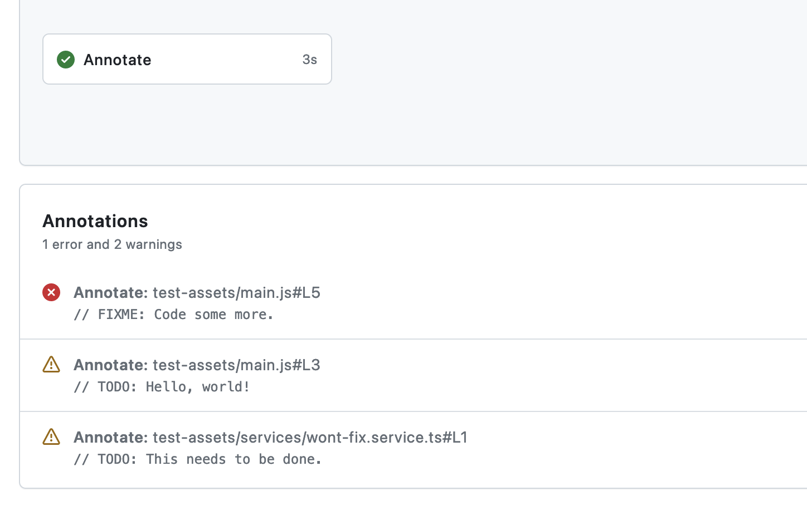

# Comment Annotator

GitHub Action for turning code comments into annotations. Looks for `TODO` and `FIXME` comments by default but search can be fully customized.



## Features

- Searches repository files with a regular expression and outputs matches annotations to workflow run summary view.
  - By default looks for comments beginning with "TODO" or "FIXME". Comments are defined as lines beginning with optional whitespace and `//`, `#`, `!`, `'` or `;`.
  - Parses files line-by-line, i.e., multiline matching is not possible.
- Uses warning and error annotation types for comments including "TODO" and "FIXME", respectively.
  - If you define a custom search pattern, comments including neither "TODO" nor "FIXME" will be annotated using the notice type.
- Somewhat configurable, see [Inputs](#inputs).

## Usage

Default settings annotate common single-line comments that begin with "TODO" or "FIXME", searching over all files in the repository.

### Example Workflow File

```yaml
name: Comment Annotator Example

on:
  push:

jobs:
  annotate:
    runs-on: ubuntu-latest
    steps:
      - uses: actions/checkout@v4
      # Using major version tag is recommended to automatically use patches.
      - uses: joonashak/comment-annotator@v1
        # All inputs are optional. See below for specs.
        with:
          pattern: "^\\s*(//|#|\\!|'|;)\\s*(TODO).*"
          include: "*.ts"
          working-dir: "src"
```

### Inputs

All inputs are optional.

#### `pattern`

Override the default regular expression pattern with your own. This pattern is used to search for lines to annotate by passing it to `grep` (with `-E` option).

The default pattern is `"^\s*(//|#|\!|'|;)\s*(TODO|FIXME).*"`.

#### `include`

Glob pattern for filtering processed files by path and/or name. Value is passed to `grep --include`.

By default, all files are included. To annotate from only JavaScript files, for example, use `"*.js"` as value.

#### `working-dir`

Run action in given directory instead of repository root.

Note that this affects the execution context of the whole action which might affect your `include` pattern. For example, if you used `include: "src/*"` and then set also `working-dir: "src"`, the effective include pattern with respect to repository root would be `src/src/*`.
